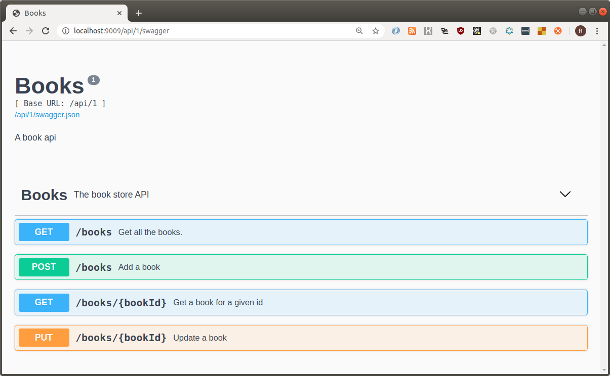
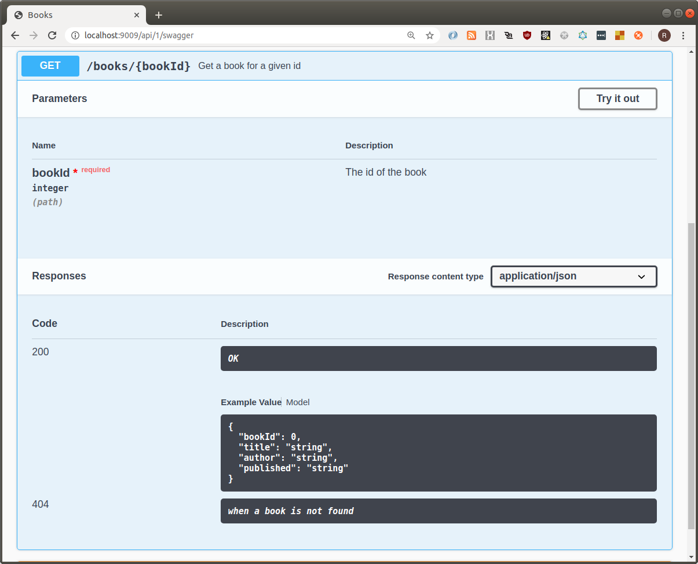

# Getting Started

The router provided by this package maps the arguments and
types of request handlers.

We will create a mock book repository.

## Creating typed dictionaries

Here is the type of a book. We use `TypedDict` to allow automatic type discovery

```python
from datetime import datetime
try:
    # Available in 3.8
    from typing import TypedDict  # type:ignore
except:
    # Available in 3.7
    from typing_extensions import TypedDict

class Book(TypedDict):
    """A Book

    Args:
        book_id (int): The book id
        title (str): The title
        author (str): The author
        published (datetime): The publication date
    """
    book_id: int
    title: str
    author: str
    published: datetime
```

Note: the docstring will be used to provide documentation for swagger.

## Creating the API

Now we can build the API.

```python
from typing import Dict, List

from bareasgi_rest import RestError


BOOKS: Dict[int, Book] = {}
NEXT_ID: int = 0

async def get_books() -> List[Book]:
    """Get all the books.

    This method gets all the books in the shop.

    Returns:
        List[Book]: All the books
    """
    return list(BOOKS.values())


async def get_book(book_id: int) -> Book:
    """Get a book for a given id

    Args:
        book_id (int): The id of the book

    Raises:
        ResetError: 404, when a book is not found

    Returns:
        Book: The book
    """

    if book_id not in BOOKS:
        raise ResetError(404, "Book not found")

    return BOOKS[book_id]


async def create_book(
        author: str,
        title: str,
        published: datetime
) -> int:
    """Add a book

    Args:
        author (str): The author
        title (str): The title
        published (datetime): The publication date

    Returns:
        int: The id of the new book
    """
    NEXT_ID += 1
    BOOKS[NEXT_ID] = Book(
        book_id=NEXT_ID,
        title=title,
        author=author,
        published=published
    )
    return NEXT_ID


async def update_book(
        book_id: int,
        author: str,
        title: str,
        published: datetime
) -> None:
    """Update a book

    Args:
        book_id (int): The id of the book to update
        author (str): The new author
        title (str): The title
        published (datetime): The publication date

    Raises:
        RestError: 404, when a book is not found
    """
    if book_id not in BOOKS:
        raise RestError(404, "Book not found")
    BOOKS[book_id]['title'] = title
    BOOKS[book_id]['author'] = author
    BOOKS[book_id]['published'] = published
```

We can see that errors are handler by raising RestError.
A convention has been applied such that the status code MUST
appear before the message, separated by a comma.

## Adding support for the REST router

Now we must create our application and add support for the router.

```python
from bareasgi import Application
from bareasgi_rest import RestHttpRouter, add_swagger_ui


router = RestHttpRouter(
    None,
    title="Books",
    version="1",
    description="A book api",
    base_path='/api/1',
    tags=[
        {
            'name': 'Books',
            'description': 'The book store API'
        }
    ]
)
app = Application(http_router=router)
add_swagger_ui(app)
```

Note the `base_path` argument can be used to prefix all
paths.

The `RestHttpRouter` is a subclass of the basic router, so
all those methods are also available.

## Creating the routes

Now we can create the routes:

```python
tags = ['Books']
router.add_rest({'GET'}, '/books', get_books,tags=tags)
router.add_rest({'GET'}, '/books/{bookId:int}', get_book, tags=tags)
router.add_rest({'POST'}, '/books', create_book, tags=tags, status_code=201)
router.add_rest({'PUT'}, '/books/{bookId:int}', update_book, tags=tags, status_code=204)
```

First we should note that the paths will be prefixed with the
`base_path` provided to the router.

Referring back to the implementation of `get_book` we can
see  that the camel-case path variable `bookId` has been
mapped to the snake-case `book_id` parameter. The JSON object provided in the body of the `create_book` will
similarly map camel-cased properties to the snake-cased
function parameters.

We can also see how the status codes have been overridden
for the `POST` and `PUT` endpoints, and all the routes
have the "Books" tag for grouping in the UI.

## Serving the API

Finally we can serve the API:

```python
import uvicorn

uvicorn.run(app, port=9009)
```

Browsing to http://localhost/api/1/swagger we should see:



When we expand `GET /books/{bookId}` we can see all the
information provided in the docstring and typing has been
passed through to the swagger UI.


